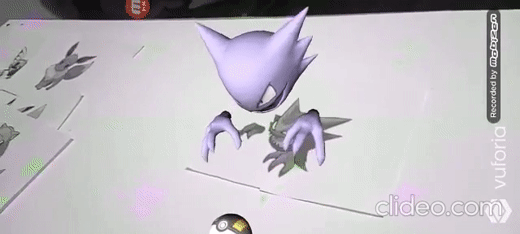

# Repository of the application corresponding to the final project of the discipline of Special Topics in Computing - Introduction to AR at the Federal University of Paraíba.

### Repositório feito para a aplicação correspondente ao projeto final da disciplina de Tópicos Especiais em Computação - Introdução à RA, da Universidade Federal da Paraíba.

  

### Usando Unity + Vuforia Engine, criei uma aplicação que exibe modelos de alguns pokémon e exibe uma áudio descrição dos mesmos.

### Using Unity + Vuforia Engine, I created an application that displays models of some pokémon and displays an audio description of them.

### Para usar é necessário que o dispositivo Android possua o recurso de Giroscópio

### To use it is necessary that the Android device has the Gyroscope feature

## Disclaimer

Não possuo direito sobre os modelos e imagens utilizadas, todos os recursos utilizados e a aplicação são para fins educacionais.
© 2020 Pokémon. © 1995–2020 Nintendo/Creatures Inc./GAME FREAK inc. Pokémon, os nomes dos personagens Pokémon, Nintendo Switch, Nintendo 3DS, Nintendo DS, Wii, Wii U e WiiWare são marcas da Nintendo.
Demais marcas são propriedade de seus respectivos donos.

I have no right over the models and images used, all the resources used and the application are for educational purposes.
© 2020 Pokémon. © 1995–2020 Nintendo/Creatures Inc./GAME FREAK inc. Pokémon, Pokémon character names, Nintendo Switch, Nintendo 3DS, Nintendo DS, Wii, Wii U, and WiiWare are trademarks of Nintendo, Other trademarks are the property of their respective owners.
